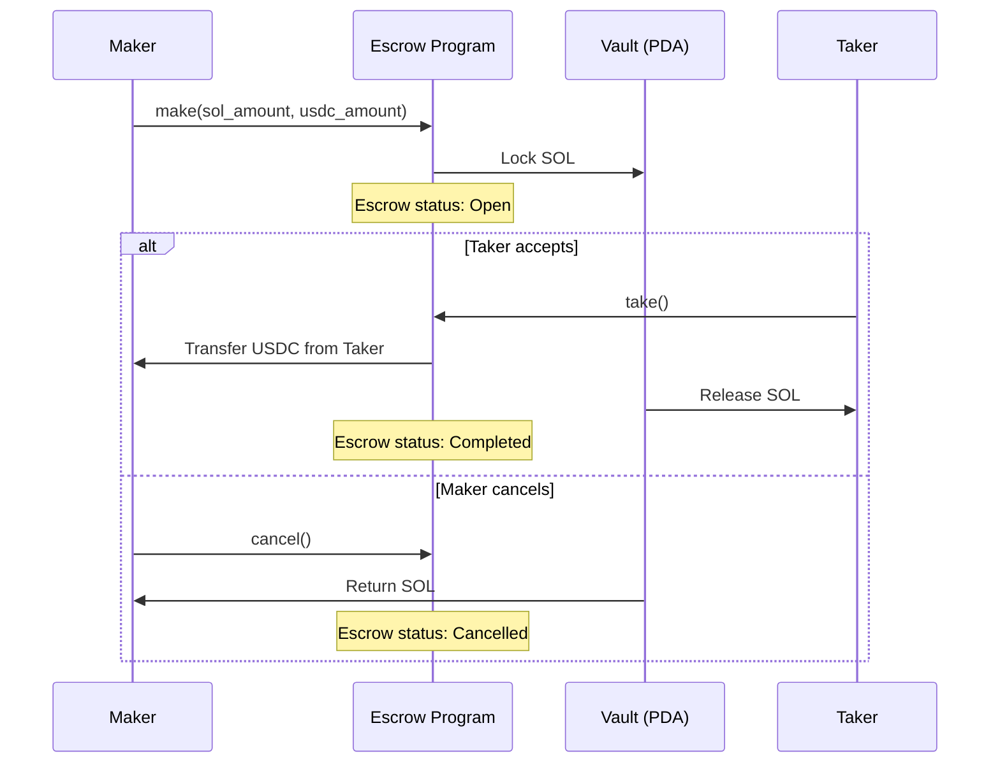

# SOL-USDC Escrow

A trustless escrow program built with Anchor on Solana. A **Maker** locks SOL and specifies how much USDC they want in return. A **Taker** fulfills the trade by depositing the exact USDC amount. The program swaps both assets atomically — no trust required.

## Why an Escrow?

Without an escrow, one party always has to send first and hope the other follows through:

- Maker sends SOL first — Taker disappears with it.
- Taker sends USDC first — Maker disappears with it.

The escrow program eliminates this risk. SOL is locked in a program-controlled vault, and the swap only executes when both sides are satisfied atomically.

## How It Works



## Instructions

| Instruction | Caller | Description |
|-------------|--------|-------------|
| `make` | Maker | Lock SOL in a vault and set the desired USDC price. Creates the escrow account. |
| `take` | Taker | Deposit the required USDC to the Maker and receive the locked SOL from the vault. |
| `cancel` | Maker | Cancel an open escrow and reclaim the locked SOL. Only the original Maker can cancel. |

## Accounts

### Escrow (PDA)

Stores the trade metadata. Seeded with `["escrow", maker_pubkey]`.

### Vault (PDA)

A program-controlled system account that holds the locked SOL. Seeded with `["vault", escrow_pubkey]`.


## Setup

```bash
anchor build
anchor deploy
anchor test
```

## Dependencies

- `anchor-lang` 0.32.1
- `anchor-spl` 0.32.1
