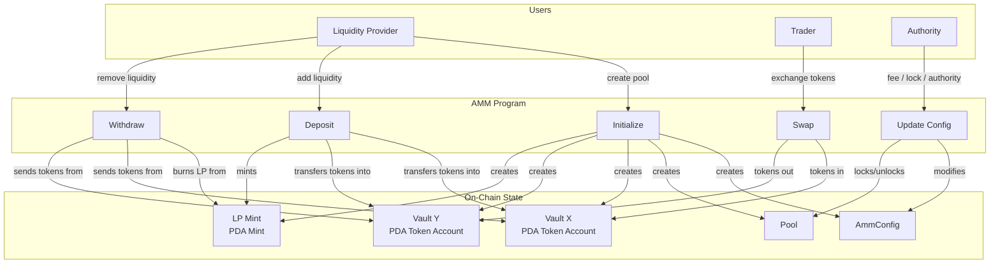

# Architecture Overview

High-level view of how users interact with the AMM program and the on-chain accounts it manages.

Three user roles exist:

- **Liquidity Provider** — creates pools, deposits token pairs, withdraws by burning LP tokens.
- **Trader** — swaps one token for the other through the constant-product curve.
- **Authority** — the address that initialized the pool. Can update fees, lock/unlock the pool, transfer authority, or permanently renounce it.

Every account the program creates (config, pool, vaults, LP mint) is a PDA — no keypairs are stored, all addresses are deterministic from seeds.
