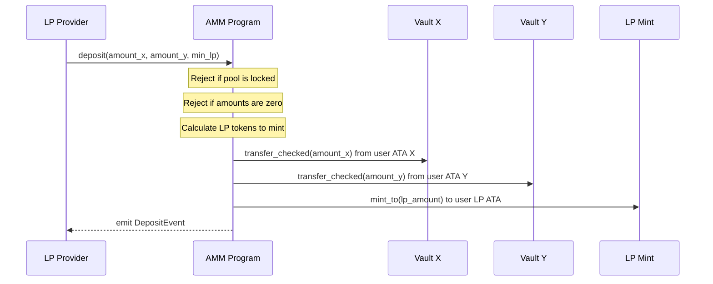
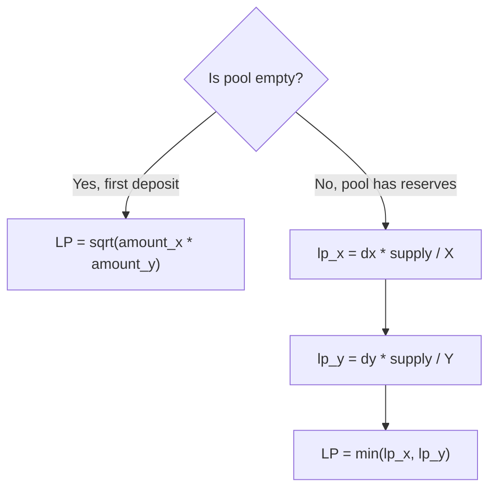

# Deposit

Adds liquidity to an existing pool. Transfers tokens X and Y from the user into the pool vaults and mints LP tokens back to the user.

## Parameters

| Name | Type | Description |
|------|------|-------------|
| `amount_x` | `u64` | Token X to deposit |
| `amount_y` | `u64` | Token Y to deposit |
| `min_lp` | `u64` | Minimum LP tokens to receive (slippage protection) |

## LP Calculation

- **First deposit** uses the geometric mean — there is no existing ratio to follow.
- **Subsequent deposits** calculate LP contribution from each side independently and take the minimum. This prevents a depositor from skewing the ratio to extract value.
- If the calculated LP is below `min_lp`, the transaction reverts with `SlippageExceeded`.
