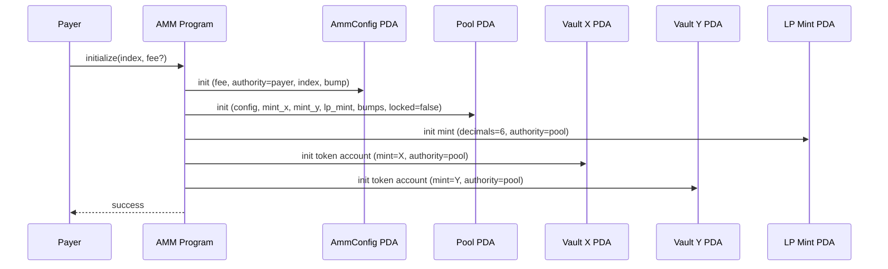

# Initialize

Sets up everything the AMM needs before any trading can happen. A single call to `initialize` creates the config, pool, LP mint, and both token vaults — all derived as PDAs so their addresses are deterministic.

The instruction takes an `index` (u64) to uniquely identify this pool's config and an optional `fee` in basis points (defaults to 30 / 0.3%, max 100 / 1.0%). The payer who signs the transaction is set as the config authority and pays rent for all five accounts. The pool starts unlocked and with empty vaults — it's ready for the first `deposit`.
