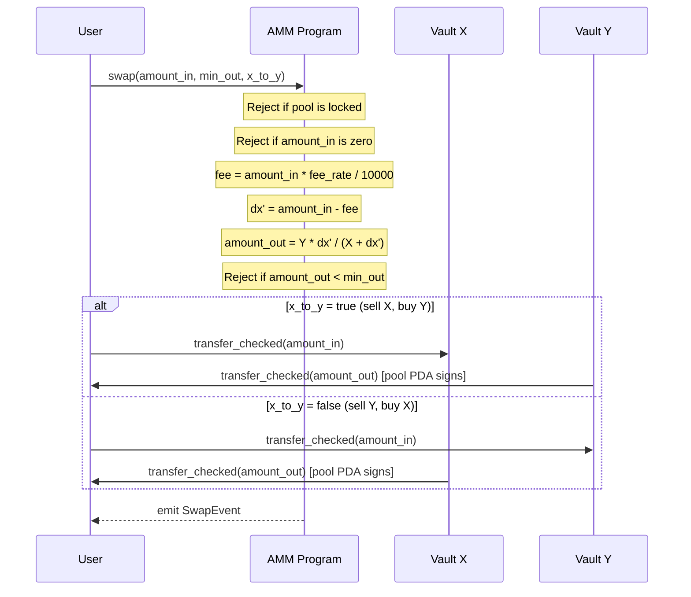
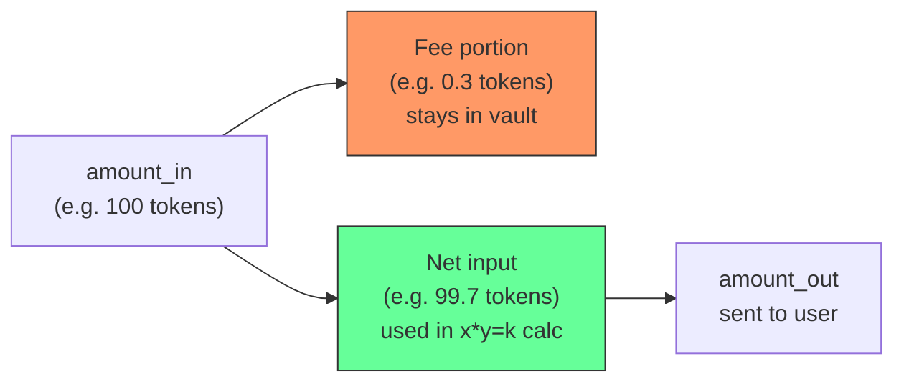

# Swap

Exchanges one token for the other using the constant-product (`x * y = k`) invariant. A fee is deducted from the input before the swap calculation.



## Parameters

| Name | Type | Description |
|------|------|-------------|
| `amount_in` | `u64` | Tokens the user sends in |
| `min_out` | `u64` | Minimum tokens to receive (slippage protection) |
| `x_to_y` | `bool` | `true` = send X, receive Y. `false` = send Y, receive X |

## Fee Handling



The fee tokens stay inside the vault. This grows the reserves relative to LP supply, which means each LP token is backed by more underlying tokens over time. That growth is how liquidity providers earn yield.

## Constant Product Formula

```
amount_out = vault_out * dx' / (vault_in + dx')
```

Where `dx' = amount_in - fee`. The product `vault_in * vault_out` is preserved (increases slightly due to the fee), maintaining the `k` invariant.
