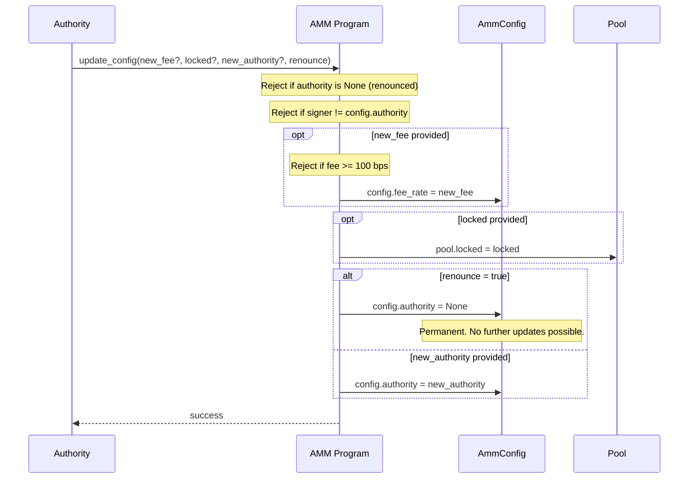

# Update Config

Authority-only instruction. Modifies the pool configuration: fee rate, lock state, authority transfer, or permanent renouncement.

## Parameters

| Name | Type | Description |
|------|------|-------------|
| `new_fee` | `Option<u16>` | New fee in basis points (must be < 100) |
| `locked` | `Option<bool>` | `true` pauses deposits and swaps, `false` resumes |
| `new_authority` | `Option<Pubkey>` | Transfer authority to a different address |
| `renounce` | `bool` | If `true`, sets authority to `None` permanently |

## Lock Behavior

When `pool.locked = true`:
- `deposit` reverts with `PoolLocked`
- `swap` reverts with `PoolLocked`
- `withdraw` still works (users can always exit)

## Renounce

Setting `renounce = true` writes `None` to `config.authority`. After this, any call to `update_config` will fail with `AuthorityRenounced`. There is no way to undo this. The fee rate and lock state become frozen at their current values.
