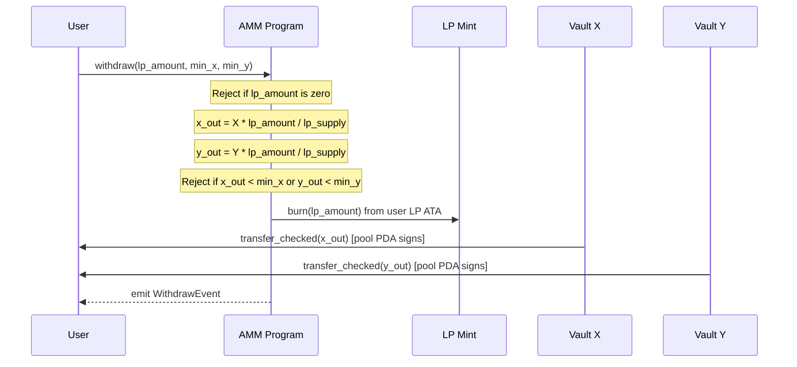

# Withdraw

Removes liquidity from the pool. Burns the user's LP tokens and returns a proportional share of both token X and token Y from the vaults.



## Parameters

| Name | Type | Description |
|------|------|-------------|
| `lp_amount` | `u64` | LP tokens to burn |
| `min_x` | `u64` | Minimum token X to receive (slippage protection) |
| `min_y` | `u64` | Minimum token Y to receive (slippage protection) |

## Withdrawal Formula

```
x_out = vault_x * lp_amount / lp_supply
y_out = vault_y * lp_amount / lp_supply
```

The withdrawal is strictly proportional. Burning 50% of LP supply returns 50% of each reserve. Because swap fees continuously grow the vault balances, the tokens returned will be more than what was originally deposited — that difference is the LP yield.

LP tokens are burned **before** the vault transfers. This ordering ensures the supply is already reduced, preventing reentrancy-style issues.
