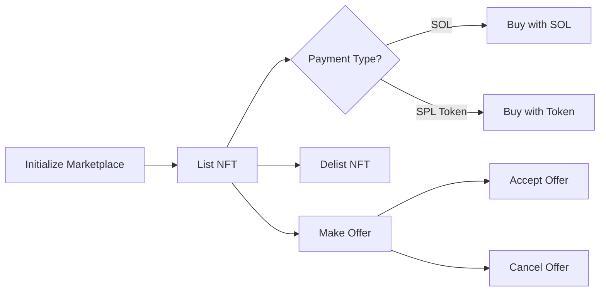

# NFT Marketplace

A Solana NFT marketplace program built with Anchor and Metaplex Core (MPL Core). Supports listing, buying, delisting, and offer-based trading of MPL Core assets with SOL or SPL token payments.

Program ID: `3McokwkwSf5UFtgxiHRXbG1o9A7AmDdMajLn4YtbvR4U`

## How It Works



1. An admin initializes a marketplace with a name, fee (basis points), and a rewards mint.
2. Sellers list MPL Core assets at a set price. The NFT is transferred into escrow (listing PDA) via MPL Core `TransferV1`.
3. Buyers purchase with SOL or SPL tokens. The price splits between the seller and the marketplace treasury. Buyers receive reward tokens.
4. Buyers can also place SOL offers on listed assets. The offered SOL is escrowed in a vault PDA. Sellers can accept or the buyer can cancel for a full refund.

## Instructions

| Instruction | Description |
|---|---|
| `initialize` | Admin creates a marketplace with name, fee, treasury PDA, and rewards token mint |
| `list` | Seller lists an MPL Core asset at a price, optionally specifying an SPL token for payment |
| `delist` | Seller reclaims their listed NFT; listing account is closed and rent refunded |
| `buy` | Buyer purchases a listed NFT with SOL; fee goes to treasury, buyer gets reward tokens |
| `buy_with_token` | Same as `buy` but payment is made with the SPL token specified at listing time |
| `make_offer` | Buyer places a SOL offer on a listed asset; SOL is escrowed in a vault PDA |
| `accept_offer` | Seller accepts an offer; escrowed SOL splits between seller and treasury, NFT transfers to buyer |
| `cancel_offer` | Buyer cancels their offer and receives a full refund of escrowed SOL |

## On-chain Accounts

| Account | Seeds | Description |
|---|---|---|
| `MarketPlace` | `["market_place", name]` | Stores admin, fee (basis points), treasury bump, rewards mint bump, marketplace bump |
| `Listing` | `["listing", asset]` | Stores maker, asset, price, optional payment mint, bump |
| `Offer` | `["offer", asset, taker]` | Stores taker, asset, amount, bump |
| `OfferVault` | `["offer_vault", offer]` | SystemAccount PDA that holds escrowed SOL for an offer |
| Treasury | `["treasury", admin]` | SystemAccount PDA that receives marketplace fees |
| Rewards Mint | `["rewards", marketplace]` | SPL token mint (6 decimals) for buyer rewards; authority = marketplace PDA |

## Fee Model

Fees are specified in basis points (1 bp = 0.01%) during marketplace initialization.

```
fee_amount    = price * fee / 10_000
seller_amount = price - fee_amount
```

Example: a fee of `250` = 2.5%.

## Rewards

Buyers receive reward tokens proportional to the purchase price:

```
reward_amount = price_in_lamports / 1_000
```

This gives 1 reward token (with 6 decimals) per SOL spent.

## Prerequisites

- [Rust](https://rustup.rs/)
- [Solana CLI](https://docs.solanalabs.com/cli/install) (v2.x)
- [Anchor CLI](https://www.anchor-lang.com/docs/installation) (v0.32.x)
- Node.js and Yarn

## Build and Test

```bash
yarn install
anchor build
anchor test
```

## Tests

The test suite covers:

- **Initialize** — Creates the marketplace and verifies stored state
- **List** — Lists an MPL Core NFT for SOL and verifies escrow ownership
- **Buy with SOL** — Purchases a listed NFT, verifies listing closure, fee split, reward minting, and NFT transfer
- **Delist** — Lists then delists, verifying NFT returns to seller
- **Buy with Token** — Purchases a listed NFT with SPL tokens, verifies token transfers and reward minting
- **Make Offer** — Places a SOL offer and verifies escrowed SOL in the vault
- **Cancel Offer** — Cancels an offer and verifies full refund to the buyer
- **Accept Offer** — Full flow: list, offer, accept — verifies NFT transfer, fee split, and SOL distribution

## Dependencies

### On-chain

- `anchor-lang` v0.32.1
- `anchor-spl` v0.32.1
- `mpl-core` v0.11.2

### Client / Tests

- `@coral-xyz/anchor`
- `@metaplex-foundation/mpl-core`
- `@metaplex-foundation/umi`
- `@metaplex-foundation/umi-bundle-defaults`
- `@solana/spl-token`
- `@solana/web3.js`
