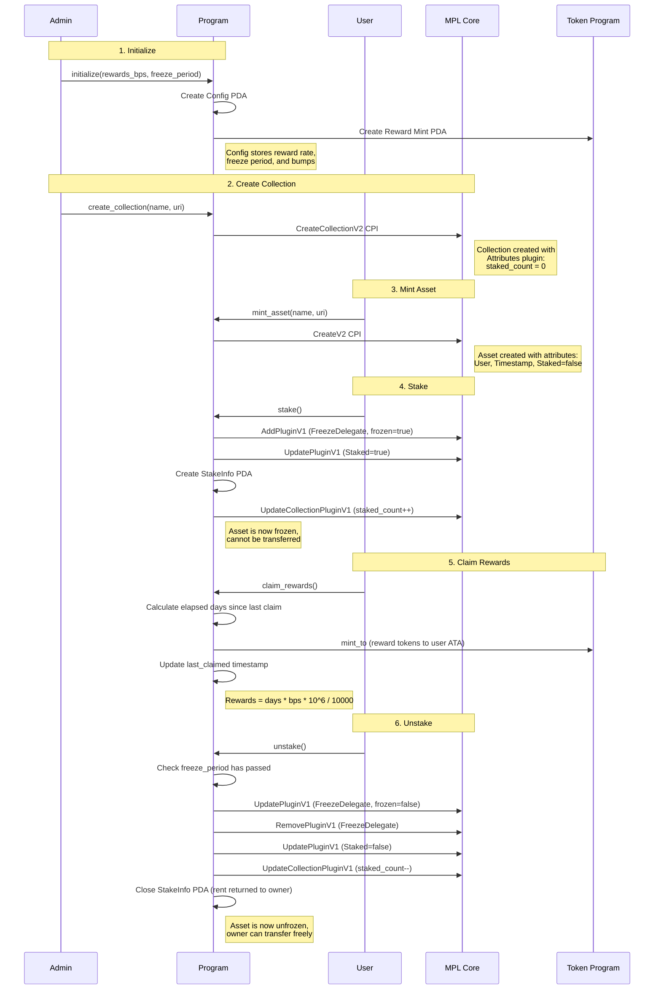
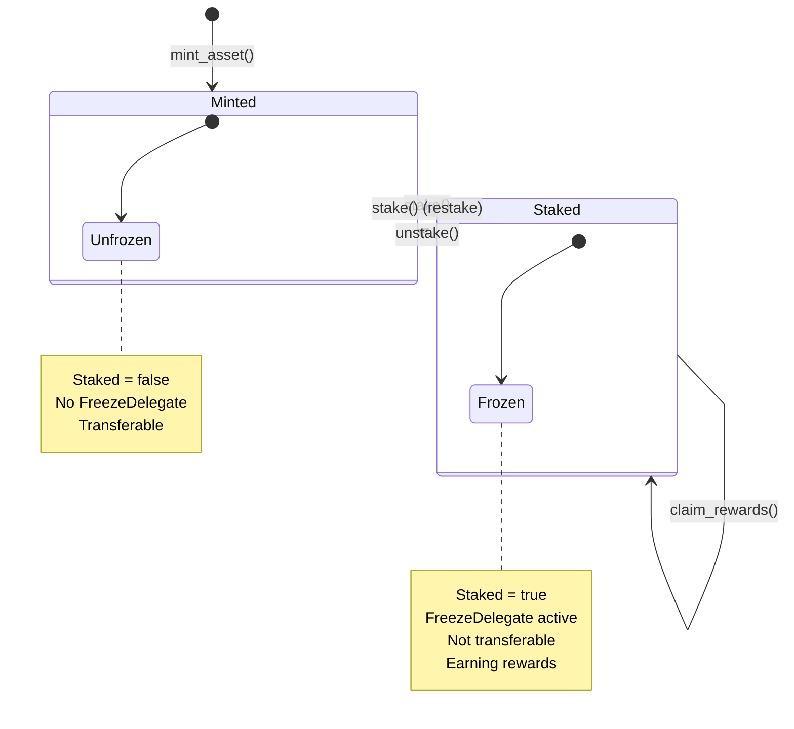
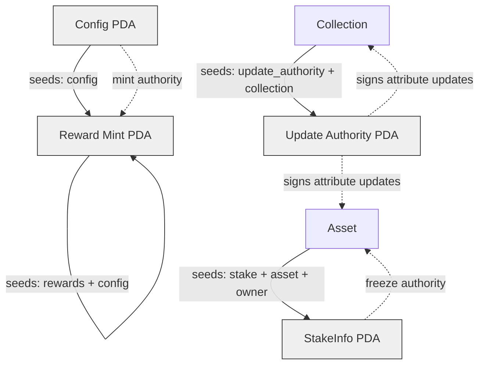

# NFT Staking Flow

This document describes the lifecycle of staking an MPL Core NFT, from initialization through claiming rewards and unstaking.

## Full Lifecycle Diagram

## State Transitions

## PDA Relationships

## Freeze Period

The freeze period is configured during initialization and measured in days. When a user stakes an NFT:

1. `staked_at` timestamp is recorded in the StakeInfo PDA
2. When unstaking, the program checks: `(now - staked_at) >= freeze_period * 86400`
3. If the freeze period has not passed, the unstake is rejected with `FreezePeriodNotPassed`

This prevents users from gaming the system by rapidly staking and unstaking.

## Reward Calculation

Rewards are calculated on each `claim_rewards` call:

1. `elapsed = now - last_claimed` (seconds)
2. `elapsed_days = elapsed / 86400` (integer division, partial days are not counted)
3. `reward_amount = elapsed_days * rewards_bps * 1_000_000 / 10_000`

The `last_claimed` timestamp is updated to `now` after each claim. The `staked_at` timestamp is never modified, so the freeze period always counts from the original stake time.
