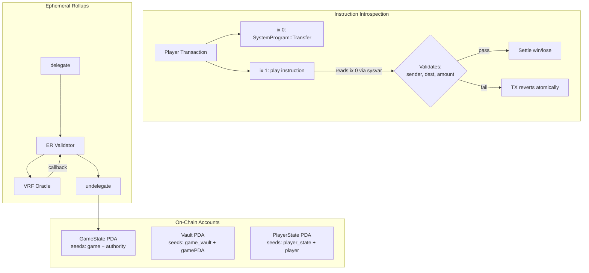

# Pay-to-Guess

A provably fair dice game on Solana that leverages **instruction introspection** to enforce atomic payments and **MagicBlock Ephemeral Rollups VRF** for verifiable on-chain randomness.

**Program ID:** `452bo1TyLVXwB9hrcwNGQRxk23yB8nc6LAVHqspY3Dv5`

**Network:** Devnet

## Overview

Players place a bet and guess a number between 1 and 6. A VRF oracle generates the roll on an Ephemeral Rollup, and the result is committed back to devnet. If the guess matches the roll, the player wins 2x their bet from the vault. All payment verification is handled at runtime through Solana's instruction sysvar — no trust assumptions required.

## Game Flow

```mermaid
sequenceDiagram
    participant Authority
    participant Devnet
    participant ER as Ephemeral Rollups
    participant Oracle as VRF Oracle
    participant Player

    Authority->>Devnet: initialize_game(prize_pool, bet_bps)
    Note over Devnet: GameState + Vault PDAs created<br/>Prize pool deposited

    rect rgb(40, 40, 60)
        Note over Devnet,ER: Randomness Phase (off-chain VRF)
        Authority->>Devnet: delegate_account(gamePDA)
        Devnet-->>ER: GameState cloned to ER
        Authority->>ER: request_randomness(seed)
        ER->>Oracle: VRF request
        Oracle->>ER: callback_randomness(roll 1-6)
        Authority->>ER: undelegate()
        ER-->>Devnet: Committed state returned
    end

    Note over Devnet: roll_ready = true

    rect rgb(40, 60, 40)
        Note over Devnet,Player: Play Phase (atomic settlement)
        Player->>Devnet: TX { ix[0]: Transfer bet → vault, ix[1]: play(guess) }
        Note over Devnet: Introspection verifies ix[0]:<br/>correct sender, destination, amount
        alt guess == roll
            Devnet->>Player: 2x bet payout from vault
        else guess != roll
            Note over Devnet: Bet absorbed into prize pool
        end
    end

    Authority->>Devnet: close_game()
    Note over Devnet: Vault drained, accounts closed
```



## Architecture



## Instruction Introspection

The `play()` instruction uses Solana's **instruction sysvar** (`Sysvar1nstructions1111111111111111111111111`) to read the preceding instruction within the same transaction at runtime. It enforces:

1. The previous instruction is a `SystemProgram::Transfer` (discriminator = 2)
2. The source account is the player's wallet
3. The destination is the game vault PDA
4. The transfer amount meets or exceeds the required bet

If any check fails, the entire transaction reverts atomically — the player never loses funds without a valid game round occurring.

**Reference:** [Solana Instruction Introspection — RareSkills](https://rareskills.io/post/solana-instruction-introspection)

## Program Instructions

| Instruction | Description |
|---|---|
| `initialize_game(prize_pool, bet_bps)` | Create GameState + Vault PDAs, deposit prize pool SOL |
| `delegate_account(account_type)` | Delegate a PDA to the Ephemeral Rollups validator |
| `request_randomness(client_seed)` | Request a VRF roll on the Ephemeral Rollup |
| `callback_randomness(randomness)` | Oracle callback — stores roll result (1–6) in GameState |
| `undelegate()` | Commit ER state and return PDA ownership to devnet |
| `play(guess)` | Submit guess with introspection-verified payment, settle win/lose |
| `close_game()` | Authority closes game, drains vault, reclaims rent |

## Account Layout

```
GameState (PDA: ["game", authority])
├── authority:    Pubkey
├── prize_pool:   u64
├── bet_amount:   u64       // prize_pool * bet_bps / 10_000
├── bet_bps:      u16
├── total_rounds: u64
├── current_roll: u8        // VRF result (1–6), 0 when consumed
├── roll_ready:   bool      // true after VRF callback
├── bump:         u8
└── vault_bump:   u8

PlayerState (PDA: ["player_state", player])
├── player:         Pubkey
├── current_guess:  u8
├── previous_guess: u8
├── current_paid:   u64
├── total_rounds:   u64
├── total_wins:     u64
└── bump:           u8

Vault (PDA: ["game_vault", gamePDA])
└── Holds SOL prize pool (SystemAccount)
```

## Tests

All tests run against **Solana devnet**. The happy-path tests require an active Ephemeral Rollups endpoint for VRF.

```bash
# Happy-path tests
anchor run "test:success"

# Fail-case tests
anchor run "test:fail"

# All tests
anchor run "test:all"
```

### Happy-Path Tests (`tests/pay-to-guess.ts`)

| # | Test | Verifies |
|---|------|----------|
| 1 | `initialize_game` | GameState fields, vault balance, bet calculation |
| 2 | `request_randomness` | Delegate → VRF request → callback → undelegate → devnet verification |
| 3 | `play` | Introspection validation, PlayerState creation, win/lose settlement |
| 4 | `play (round 2)` | PlayerState history (previousGuess, totalRounds), bet recalculation |
| 5 | `close_game` | Authority reclaims vault SOL, accounts closed |

### Fail-Case Tests (`tests/fail-cases.ts`)

| # | Test | Expected Error |
|---|------|----------------|
| 1 | No preceding payment instruction | `NoRollAvailable` (6015) |
| 2 | Payment to wrong destination | `NoRollAvailable` (6015) |
| 3 | Underpayment (half the bet) | `NoRollAvailable` (6015) |
| 4 | Guess out of range (9) | `InvalidGuess` (6001) |
| 5 | Play without VRF roll ready | `NoRollAvailable` (6015) |

> **Note:** Tests 1–3 exercise invalid payment scenarios (no payment, wrong destination, underpayment), but the deployed program checks `roll_ready` before introspection. Without a VRF cycle, `NoRollAvailable` fires first. The on-chain source has been updated to check introspection before `roll_ready` — after redeploy, these tests will return their intended errors.

## Stack

- **Anchor** 1.0.2 with `init-if-needed`
- **Ephemeral Rollups SDK** 0.15.1
- **Ephemeral VRF SDK** 0.3.0
- **solana-instructions-sysvar** 3.0.1
- **TypeScript** / Mocha / Chai (tests)
